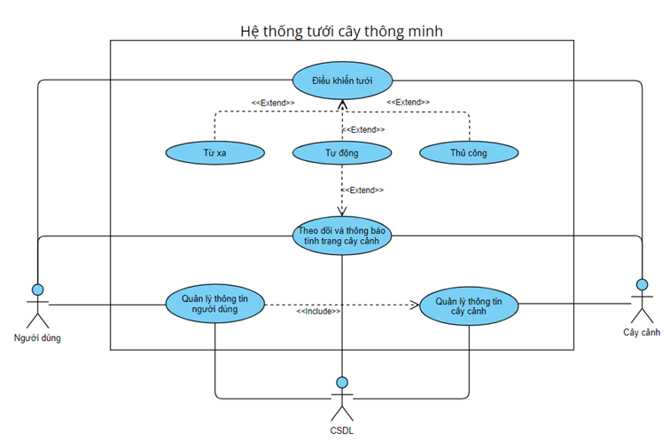
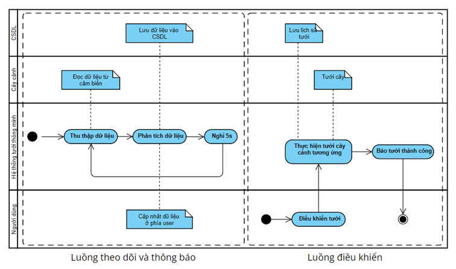
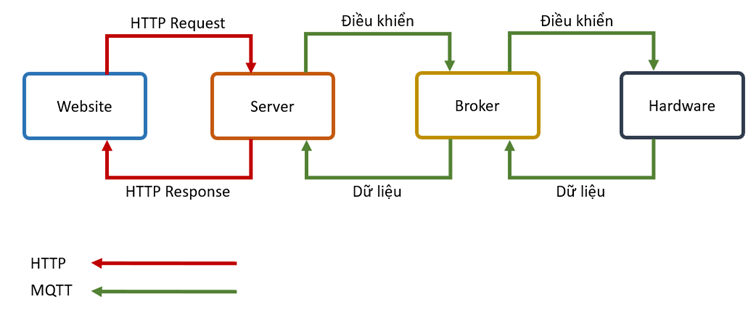
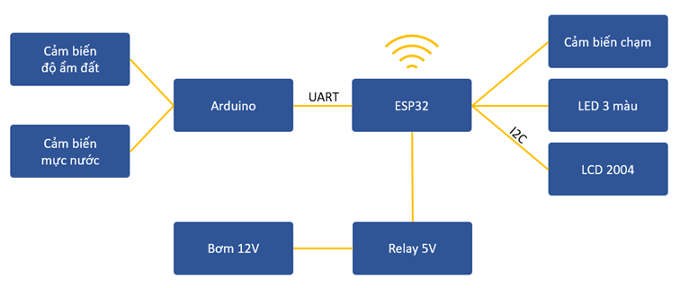
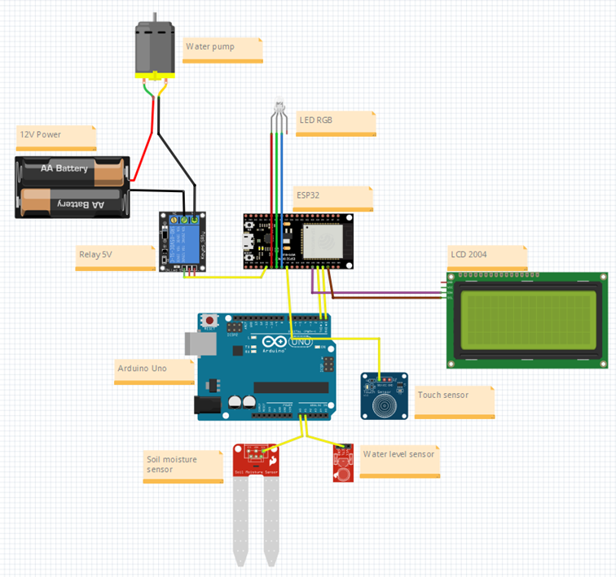

# SmartWateringSystem
Hệ thống tưới cây thông minh sử dụng Arduino, ESP32, và một số cảm biến khác.
Project được thực hiện bởi **Trần Thế Anh - 20183688**, do thầy **Phạm Huy Hoàng** hướng dẫn.

# 0. Cấu trúc thư mục
- **arduino**: Mã nguồn của arduino (file .ino)
- **esp32**: Mã nguồn của ESP32 (file .ino)
- **server**: Mã nguồn của server
- **images**: Thư mục hình ảnh

# 1. Phân tích
**Biểu đồ Use case**

**Biểu đồ Activity**

# 2. Thiết kế
**Biểu đồ giao tiếp**

**Biểu đồ kết nối phần cứng tổng quan**

**Biểu đồ kết nối phần cứng chi tiết**

# 3. Demo

Video demo hệ thống: [Google Drive](https://drive.google.com/file/d/1inkWAf-fhGCAEGeMpq0KrbDs4o74JTpB/view?usp=sharing)

